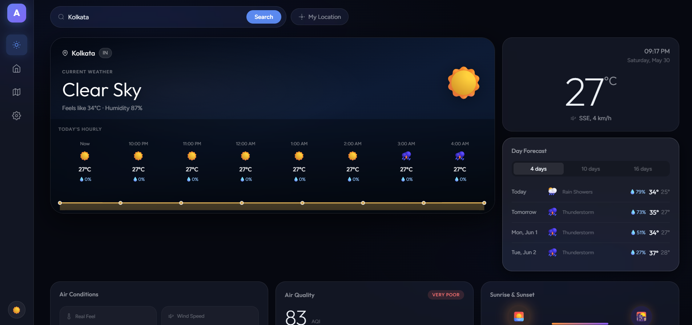

<div align="center">


# Aether Weather

**A beautifully crafted, real-time weather experience**

[](https://your-link.vercel.app)
[](https://github.com/ankitamondal-dev)
[](LICENSE)

<br/>



</div>

---

## ✦ Overview

Aether is a production-ready weather application built entirely with vanilla HTML, CSS, and JavaScript — no frameworks, no build tools, no dependencies beyond what the browser already handles beautifully.

It pulls live data from open APIs, renders it through a glassmorphism interface inspired by Apple Vision Pro, and works flawlessly across every screen size.

---

> 🌌 Live demo · [aether-by-ankita.vercel.app](https://aether-by-ankita.vercel.app)

## ✦ Features

| Feature | Details |
|---|---|
| 🌤 **Real-time Weather** | Temperature, humidity, wind speed & direction, precipitation |
| 📅 **16-Day Forecast** | Daily highs/lows, conditions, rain probability |
| ⏱ **Hourly Strip** | 8-hour temperature chart with Chart.js |
| 🌫 **Air Quality Index** | European AQI scale with PM2.5, PM10, O₃, NO₂ |
| 🗺 **Interactive Map** | Leaflet.js with temperature, cloud, rain & wind overlays |
| 🌅 **Sunrise & Sunset** | Daylight duration with animated progress arc |
| 🏙 **Saved Cities** | Up to 20 cities, persisted in localStorage |
| 📍 **Geolocation** | One-click current location detection |
| 🌙 **Dark / Light / Auto** | System-aware theme switching |
| 📱 **Fully Responsive** | Mobile bottom nav, tablet grid, desktop sidebar |
| ⚡ **PWA Ready** | Installable on desktop and mobile |

---

## ✦ Tech Stack

```
Frontend     Vanilla HTML5 · CSS3 · JavaScript ES6+
Weather API  Open-Meteo (free, no key required)
AQI API      Open-Meteo Air Quality
Geocoding    Open-Meteo Geocoding + Nominatim
Map          Leaflet.js + OpenStreetMap + OpenWeatherMap tiles
Charts       Chart.js v4
Fonts        Outfit + Figtree (Google Fonts)
Icons        Meteocons (Basmilius)
Hosting      Vercel
```

---

## ✦ Project Structure

```
aether-app/
├── index.html
├── manifest.json          # PWA manifest
├── vercel.json            # Deployment config + security headers
├── css/
│   ├── base.css           # Design tokens, reset, glass utility
│   ├── layout.css         # Sidebar, grid, hero, modals
│   ├── components.css     # Cards, AQI, sun, notifications
│   ├── animations.css     # Keyframes, transitions
│   └── responsive.css     # All breakpoints
└── js/
    ├── config.js          # WMO codes, gradients, constants
    ├── api.js             # All data fetching with timeout
    ├── storage.js         # localStorage wrapper
    ├── ui.js              # All render functions
    ├── map.js             # Leaflet integration
    ├── settings.js        # Settings modal
    └── app.js             # App orchestrator
```

---


## ✦ API Sources

All APIs used are **completely free** with no authentication required (except OWM map tiles).

| API | Purpose | Key Required |
|---|---|---|
| [Open-Meteo](https://open-meteo.com/) | Weather + forecast + AQI | ✗ Free |
| [Nominatim](https://nominatim.org/) | Reverse geocoding | ✗ Free |
| [OpenStreetMap](https://www.openstreetmap.org/) | Map base tiles | ✗ Free |
| [OpenWeatherMap](https://openweathermap.org/) | Weather map overlays | ✓ Free tier |

---

## ✦ About the Developer

<div align="center">

Built by **Ankita Mondal** — BCA Student at Sister Nivedita University, Kolkata.
Passionate about building beautiful, functional web experiences.

[](https://linkedin.com/in/ankitamondal-dev)
[](https://github.com/ankitamondal-dev)

</div>

---

<div align="center">
  <sub>Designed & developed with care · © 2026 Ankita Mondal</sub>
</div>
